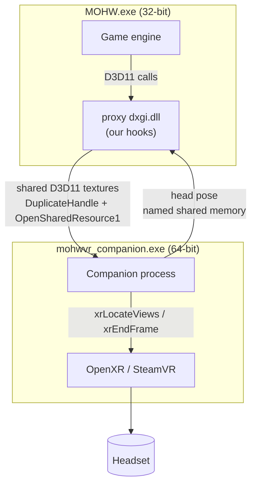
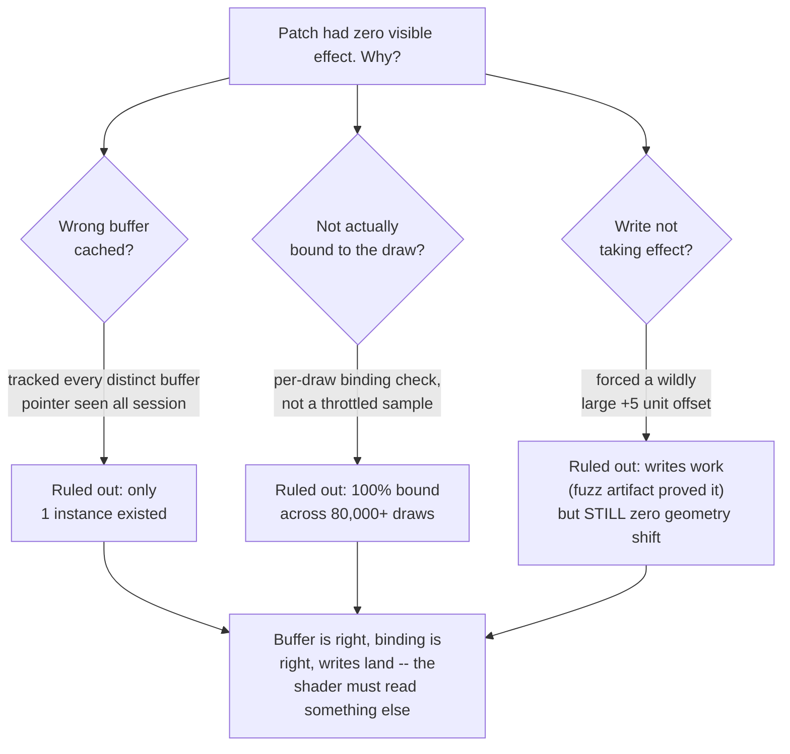
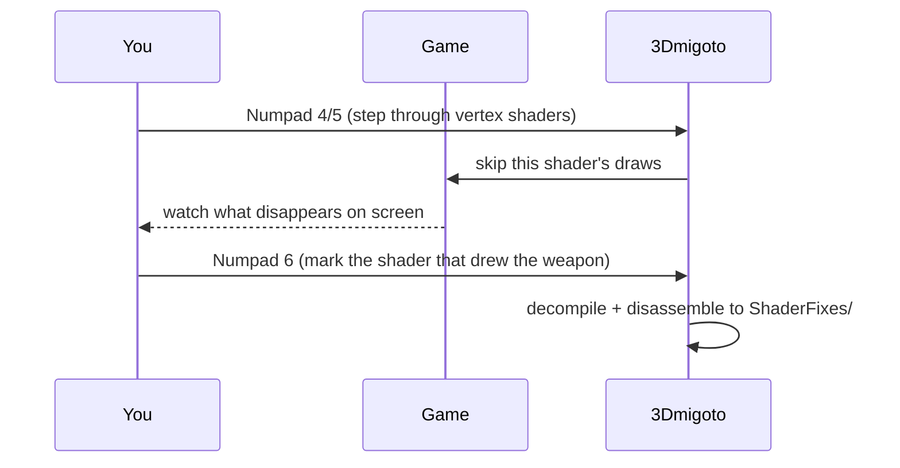
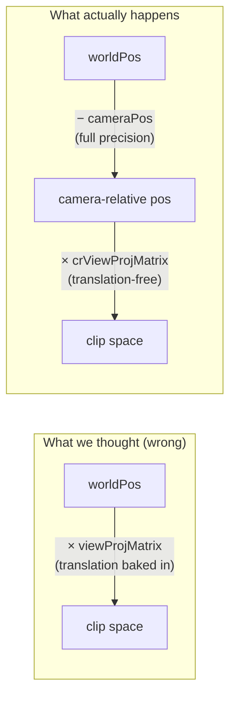
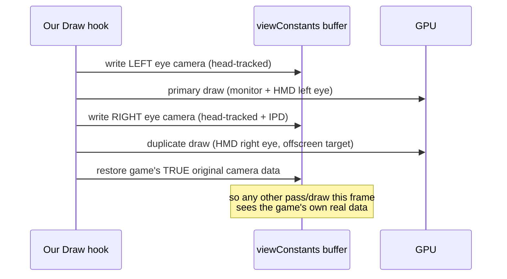

# Stereo View-Matrix Investigation: From "No Effect" to Working Head Tracking

This document tells the full story of task #14 ("patch per-eye view matrix with
HMD pose + IPD offset"): how we found the constant buffer that actually
controls where geometry is drawn on screen, why three plausible-looking
candidates all turned out to be wrong, how we used shader disassembly to get
the real answer, and the four follow-on bugs that had to be fixed before head
tracking was actually visible and correct in-headset. It's written to be
readable top-to-bottom: high-level concept first, low-level byte offsets and
function names last.

## 0. Terms and concepts, plain-language

Read this section first if any of "hook," "COM," "vtable," or "constant
buffer" aren't already familiar — everything after this assumes them. Each
entry also says *why* it matters here, not just what it means.

**Hook / hooking.** Intercepting a function call so your own code runs
before, after, or instead of the original — like tapping a phone line so
you can listen in or change what's said before it's connected. It's the
core technique of this entire project: without access to the game's source
code, hooking is the only way to observe what it's doing internally or
change its behavior.

**DLL injection.** Getting your own compiled code to load and *run inside*
another program's process. This matters because hooking only works within
the same process — you can't intercept a function call happening in
someone else's memory space from outside it. Injection is the prerequisite
that makes hooking possible at all.

**Proxy DLL.** A specific, low-key injection technique: name your DLL
*exactly* the same as a real system DLL the game already loads (here,
`dxgi.dll`), drop it in the game's own folder (Windows checks a program's
own directory before the system folders), and have your DLL forward every
real function through to the genuine system DLL — loaded separately, by
its full path — so the game keeps working normally. You get to run your
own code the moment it loads, and hook whatever you want from inside.
Why this approach specifically: no separate injector process, no
code-injection exploits, no elevated privileges — it just relies on how
Windows already resolves DLL names by searching the program's own
directory first.

**COM (Component Object Model).** A decades-old Microsoft standard
defining a fixed, versioned binary layout for how one piece of *compiled*
code can call into another — no matching source code, no matching
compiler, not even a matching language required, as long as both sides
agree on the binary shape. All of DirectX is built on COM. Why it matters
here: it's *why* the vtable-hooking technique in §14.1 works reliably —
COM guarantees a stable, documented function-pointer layout, so "the 15th
function pointer" can be found from a public header alone, with total
confidence it'll match the real, running object.

**vtable (virtual table).** The actual mechanism behind COM, and behind
C++ virtual functions generally: a plain array of function pointers, one
per method, stored *once* per interface and shared by every instance of
it. An object doesn't carry its own private copy of its methods — just a
pointer to this one shared table. Why it matters: because the table is
*shared*, patching one entry — even via a disposable, throwaway instance
you create yourself purely to get a pointer to peek at — changes that
function for every instance in the whole process, including the game's
real object you never had access to.

**Hooking library (MinHook, in this project).** A small library that
automates the messy, machine-code-level part of hooking: overwriting the
first few bytes of a target function with a jump to your own code, while
preserving a callable copy of the original bytes (the "trampoline," below)
so the real behavior is still reachable. Doing this correctly by hand
(variable-length x86 instructions, relocations, keeping it thread-safe
while patching *live, executing* code) is a well-known minefield — a
mature library exists specifically so nobody has to solve it twice.

**Trampoline.** The saved, still-functional copy of a hooked function's
original code that a hooking library hands back to you, letting your hook
call through to the *real* behavior (e.g. actually mapping the GPU buffer)
instead of only ever intercepting and never delegating.

**DirectX 11 / D3D11.** The graphics API this specific game uses to talk
to the GPU. Practical relevance: everything the game draws, no matter
which internal engine systems decided to draw it, ultimately funnels
through a small, fixed set of D3D11 function calls (`Draw`, `Map`,
`Present`, ...). Hook those few functions, and you can see or alter
*every* draw and *every* piece of data before it reaches the screen —
without needing to understand anything about the game's own internal
architecture.

**Constant buffer (cbuffer).** A block of GPU memory holding values a
shader reads on every invocation for a batch of vertices or pixels —
camera matrices, lighting, material colors, and so on. "Constant" means it
stays fixed across all the vertices/pixels *within* one draw call, not
that it never changes — it's normally rewritten every frame or every few
draws. Why it matters: this is where "the camera" actually lives, in
whatever specific form the game's own compiled shaders happen to expect —
not a concept the graphics API itself understands, just raw bytes a shader
was compiled to read at a fixed offset.

**Vertex shader.** A small GPU program, compiled from HLSL, that runs once
per vertex and outputs where that vertex ends up on screen. Why it
matters: it's the *only* place "world position becomes screen position"
actually happens, which makes reading it directly (§14.4) the definitive
source of truth for "what data really controls the camera" — strictly
more authoritative than any inference from buffer layout or content, no
matter how convincing that inference looks.

**HLSL.** Microsoft's C-like shading language, which compiles down to the
GPU bytecode a vertex/pixel shader actually executes. Disassembling that
bytecode (or decompiling it back toward readable HLSL) is how you read a
shader's real logic having never had its source — the compiler's own
`[unused]` annotations on unread fields are a direct, first-party fact,
not a guess.

**Epsilon comparison.** Two floating-point values computed via different
paths rarely come out *bit-for-bit* identical even when they're
mathematically the same value, because of how rounding accumulates
differently along each path. Comparing with a small tolerance
(`fabsf(a - b) < 0.01f`) instead of exact equality (`a == b`) avoids false
negatives caused by this — used throughout the signature-scanning
technique in §14.2.

### Why do this at all?

This specific project is adding stereoscopic, head-tracked VR rendering to
a game that was never built for it — but the exact same category of
technique (hook the graphics API, find the right buffer, patch it) is how
a lot of legitimate, well-established tooling works:

- **Stereo-3D and VR injection mods** — this project, and the broader
  community of tools it draws on (3Dmigoto, and its predecessor Helix
  Mod), exist specifically to add stereoscopic rendering to games that
  shipped flat.
- **Compatibility and accessibility patches** — widescreen/ultrawide
  fixes, FOV unlockers, colorblind filters, and UI-scaling patches for
  older games whose original studios are no longer supporting them.
- **Visual overlays and post-processing** (ReShade, ENB) — injecting
  extra rendering passes (sharpening, ambient occlusion, tone mapping)
  into games that never shipped with them, using this same
  hook-the-graphics-API foundation.
- **Preservation and long-term compatibility work** — keeping older games
  running and moddable on current hardware and operating systems once
  official support has ended.
- **Professional graphics debugging** (RenderDoc, PIX, NVIDIA Nsight) —
  built on precisely this category of technique (intercepting D3D calls)
  so developers can inspect what their *own* engine is doing, frame by
  frame, in production builds.
- **Fan translation and localization patches** for games that never
  received an official release in a given language.

The same low-level mechanism (hooking, memory scanning, shader
disassembly) is also how game trainers and cheat tools work — worth being
aware of, since it's the same toolbox, even though everything in this
document is aimed at the modding/debugging/preservation side of that list.

## 1. The problem, in one picture

MOHW is a flat (non-VR) DX11 game. Our mod doesn't have access to source or
shaders — it only sees Direct3D API calls. To get stereo 3D, the plan is:
render every frame **twice**, once per eye, with each eye's camera nudged
sideways by half the IPD (interpupillary distance) and rotated by the HMD's
current head pose. The "render twice" part (draw-call duplication into an
offscreen target) was solved back in Phase 2C. What remained was the much
harder half: **finding which piece of GPU memory to edit** so that the
second render actually uses a different camera.


Sounds simple. The hard part: DirectX 11 doesn't label its GPU buffers
`"the camera matrix"` — it's just an opaque blob of bytes the game uploads
however it likes. We had to reverse-engineer which bytes, in which buffer,
at which byte offset, actually reach the vertex shader as position data.

## 2. Architecture context (brief)



The proxy DLL can't talk to OpenXR itself (32-bit OpenXR is dead on this
SteamVR install), so a separate 64-bit companion process owns the HMD
session and hands back head-pose data over shared memory. All of the work
in this document happens entirely inside the 32-bit proxy DLL, patching
data before it reaches the GPU.

## 3. First hypothesis: "the camera buffer" (and why it seemed right)

Back in Phase 2B, we needed to find *some* buffer holding view/projection
data, with no access to shader source. The technique: hook
`ID3D11DeviceContext::Map`/`Unmap`, and every time the game CPU-writes to a
constant buffer, scan the written floats for a value we can **independently
compute** from data we already trust — specifically, the game's live `fovY`
(read from a known-good CPU struct offset), plugged into the standard D3D
perspective-projection identity:

```
proj[1][1] == 1 / tan(fovY / 2)
```

If some float in the buffer matches that computed value, we've found *a*
projection matrix, purely by content — no assumptions about layout needed.
This matched cleanly, on a 352-byte buffer, at a consistent offset, every
time. Reasonable next assumption: nearby, there's probably a view matrix and
a combined view×projection matrix too, laid out the way every textbook D3D
tutorial does it.

We found what looked like exactly that:

| Offset | Field | Looked like |
|---|---|---|
| 48 | `viewMatrix` | a transposed 4×4, valid rotation submatrix + plausible translation |
| 112 | `projMatrix` | confirmed via the fovY signature above |
| 176 | `viewProjMatrix` | matched `Projection · View` computed from the other two, byte-for-byte |

That third one felt like the smoking gun — a live search
(`SearchForPrecombinedMatrix`, since removed) computed
`Projection^T · View^T` from the two known sub-matrices and found an exact
match at offset 176, across many samples, with the camera genuinely moving.
That's about as strong as circumstantial evidence gets without seeing the
actual shader.

**We patched offset 48 and offset 176 for the right eye. Nothing moved.**

## 4. Ruling things out, one at a time

Rather than guess again, we built diagnostics to eliminate explanations
methodically:



- **Wrong / stale buffer object?** Buffers get recreated across scene loads;
  maybe our cache was pointing at an old, orphaned instance. We tracked
  *every distinct buffer pointer ever seen* matching the signature in a
  session-long `unordered_set`. Result: exactly one instance, the whole
  session. Ruled out.
- **Not actually bound when it mattered?** An earlier trap in this same
  project (with the *projection* buffer) was sampling on a throttled timer
  and accidentally only ever catching loading-screen draws. This time we
  checked binding on **every single duplicated draw**, not a periodic
  sample: 100% bound, zero exceptions, across 80,000+ real gameplay draws.
  Ruled out.
- **Is the write itself even landing?** We forced a deliberately absurd
  +5-unit camera offset (about the size of a small building) into the
  patched region and reissued the draw. If this buffer actually drove
  vertex position, the geometry should have been *obviously*, comically
  wrong. It wasn't — not even slightly. (We already knew writes reach the
  GPU at all, because an earlier, subtler version of this same patch had
  produced a visible "fuzz" artifact during loading screens — so the
  mechanism works, it's just not being read by the shader that matters.)

Conclusion: the buffer, the slot, and the write mechanism were all
confirmed correct. The only thing left unproven was the assumption that
started this whole chapter — that the shader reads `viewMatrix` /
`viewProjMatrix` the way a typical engine would. It doesn't.

## 5. The pivot: read the actual shader

At this point we were black-box guessing against a compiled game with no
symbols. Rather than keep guessing, we switched tools: **3Dmigoto**, an
open-source DX11 hooking tool built specifically for stereo-3D
reverse-engineering (the spiritual successor to Helix Mod). It has a
"hunting mode" that, live in-game, lets you cycle through every currently
active vertex shader and **skip its draws one at a time** — so you watch
pieces of the scene disappear and know exactly which shader draws them.



We found the shader responsible for skinned geometry (player, weapon, NPCs)
this way, dumped its decompiled HLSL, and got the real cbuffer layout —
straight from the compiler, not guessed:

```hlsl
cbuffer viewConstants : register(b2)
{
  float time;                          // offset 0    [unused]
  float4 screenSize;                   // offset 16   [unused]
  float3 debugNonFiniteColor;          // offset 32   [unused]
  float4x4 viewMatrix;                 // offset 48   [unused]  <- what we patched
  float4x4 projMatrix;                 // offset 112  [unused]
  float4x4 viewProjMatrix;             // offset 176  [unused]  <- what we patched
  float4x4 crViewProjMatrix;           // offset 240  [USED]
  float4   viewportZMinMaxKzKw;        // offset 304  [unused]
  float3   cameraPos;                  // offset 320  [USED]
  float3   transparentStartAndEndAndClamp; // offset 336 [unused]
}
```

The compiler itself marks `viewMatrix`, `projMatrix`, and `viewProjMatrix`
as **`[unused]`** — dead code, never read by this shader. Everything we'd
spent the previous investigation patching was structurally correct-looking
and completely irrelevant.

The actual position math, straight from the disassembly:

```hlsl
r2.xyz = worldPos.xyz - cameraPos.xyz;      // subtract camera position FIRST
r2.w = 1;
o0.x = dot(r2, crViewProjMatrix row 0);     // then multiply by crViewProjMatrix
o0.y = dot(r2, crViewProjMatrix row 1);
o0.z = dot(r2, crViewProjMatrix row 2);
o0.w = dot(r2, crViewProjMatrix row 3);
```

This is **camera-relative rendering** — a standard technique to avoid
floating-point precision loss far from the world origin. Instead of
multiplying a large world-space position by a matrix that also contains a
large translation, the engine subtracts the camera position first (in full
precision, while the numbers are still small-relative-to-camera), *then*
multiplies by a matrix that only contains rotation and projection — no
translation, because the translation was already handled by the
subtraction. That's `crViewProjMatrix` (offset 240): it's a
`Projection × View` product, but the `View` half has its translation
column zeroed out on purpose.

## 6. The fix

Patch two fields instead of the two we'd been patching:

- **`crViewProjMatrix`** (offset 240, 64 bytes) — computed the same way as
  before (rotate the camera basis by the head-pose delta, multiply by
  projection) but with **translation forced to zero**, since translation is
  handled separately.
- **`cameraPos`** (offset 320, 12 bytes) — the actual per-eye camera
  position (including the IPD offset), since the shader subtracts this
  directly.



## 7. Bug #2: the camera position was reconstructed from the wrong place

The rotation math still needed *some* camera position as a starting point
before adding the IPD offset. The obvious source was reconstructing it from
`viewMatrix`'s translation column (`camPos = -(Tx·left + Ty·up + Tz·forward)`
— standard view-matrix algebra). That field is confirmed `[unused]` by the
shader, though, which means nothing *requires* the engine to keep it
accurate — and it didn't:

| Time in session | Reconstructed camPos (from dead field) | Real camPos (buffer's own field) | Divergence |
|---|---|---|---|
| ~0s (near spawn) | roughly matched | `(0, 1, 0)` | small (coincidence) |
| ~36s (after moving) | `(-140.7, 58.2, 77.4)` | `(-58.4, 61.0, 148.5)` | **~108 units** |

That 108-unit gap is why the weapon looked comically oversized in the first
real test — the "right eye" camera had drifted 108 units away from where it
should be, nowhere near the real scene. The buffer's own `cameraPos` field
(offset 320) was correct the entire time — the left eye, which just copies
that field unmodified, proved it. **Fix:** read the real `cameraPos`
directly instead of reconstructing it from a field nothing keeps accurate.

## 8. Bug #3: only one eye moving isn't perceptible as head tracking

With the position bug fixed, the math was numerically confirmed correct
(logged, cross-checked frame by frame) — and still **nothing visible**
happened when moving your head. The reason: only the right eye (the hidden
duplicate draw) was being patched, by original design, as a deliberately
low-risk first step. One eye's image rotating while the other stays frozen
isn't perceived by the brain as "the world turned" — it reads as binocular
rivalry/suppression, essentially noise.

**Fix:** patch *both* eyes. This meant restructuring the hook to patch the
left eye's camera data **before** the game's own primary draw call (which
also feeds the monitor), not just the invisible duplicate — a materially
higher-risk change, since it now touches the always-executed rendering
path instead of a safe hidden copy.



## 9. Bug #4: rotation direction was backwards

With both eyes patched, real (if uncomfortable) head-tracking appeared —
but every axis was inverted: tipping your head up moved the world up
instead of down. The relative-rotation delta was being computed as
`current · zeroOrientation⁻¹` (rotate the camera basis *the same way* the
head turned). What's actually needed is the inverse — the scene has to turn
*opposite* to head rotation for a stationary viewer to perceive it correctly
turning around them. **Fix:** swap to `zeroOrientation · current⁻¹`
(equivalently, the conjugate of the original delta).

## 10. Bug #5: some geometry never followed at all

After the rotation-direction fix, weapon/character followed correctly, but
static building meshes and ground props didn't — and which category
"worked" flipped between test sessions. The "multiple buffer instances"
theory (tested the same way as in §4) was ruled out again — still only one
instance all session. The real cause: **we only ever hooked `Draw` and
`DrawIndexed`.** GPU instancing — the standard technique for repeated
static geometry like buildings, foliage, and props — goes through
`DrawInstanced`/`DrawIndexedInstanced` instead, two entirely separate D3D11
entry points our hooks never touched. Any draw issued that way bypassed our
patching completely, rendering once with whatever camera data happened to
be active at that moment — sometimes the left eye's data, sometimes the
restored original, depending on timing, which explains the inconsistency
between test runs. **Fix:** hook those two additional entry points with the
exact same wrapper used for `Draw`/`DrawIndexed`.

## 11. Current status

| Axis | Status |
|---|---|
| Head-tracked rotation (pitch/yaw/roll), both eyes | Working |
| IPD-based stereo separation | Working |
| Camera-relative position patch (`cameraPos`) | Working, confirmed via live logs |
| Static geometry via GPU instancing | Working (after §10 fix) |
| Overall feel | "Rough but functional" per live testing |

**Known, unresolved limitation:** the game's own CPU-side frustum
culling/geometry-streaming logic is driven entirely by the game's *own*
camera direction (i.e. mouse-look), which has no knowledge of head
rotation — that only exists in the GPU buffer we patch right before each
draw call. If you look somewhere via head movement alone that the game's
own camera hasn't faced, geometry there was never submitted as a draw call
in the first place — it isn't merely mis-rendered, it doesn't exist in the
frame at all. This is a structural limitation of *any* post-hoc
constant-buffer-patching approach to VR injection, not a bug in this
implementation. Possible mitigations (not yet attempted): artificially
widening the FOV value the game uses for its own culling decisions so it
loads more generously than it renders, or intercepting the culling logic
directly (much more invasive).

## 12. Low-level reference

**Buffer identity:** 352-byte constant buffer, HLSL name `viewConstants`,
bound at VS slot 2. Identified structurally by scanning `Map`/`Unmap`
writes for `floats[i] == 1/tan(fovY/2)` (the projection-matrix signature),
which happens to also appear inside this larger buffer.

**Full field layout** (byte offsets, from the actual HLSL reflection):

| Offset | Bytes | Field | Used by main-scene shader? |
|---|---|---|---|
| 0 | 4 | `time` | No |
| 16 | 16 | `screenSize` | No |
| 32 | 12 | `debugNonFiniteColor` | No |
| 48 | 64 | `viewMatrix` | **No** |
| 112 | 64 | `projMatrix` | **No** |
| 176 | 64 | `viewProjMatrix` | **No** |
| 240 | 64 | `crViewProjMatrix` | **Yes** — translation-free view×proj |
| 304 | 16 | `viewportZMinMaxKzKw` | No |
| 320 | 12 | `cameraPos` | **Yes** — subtracted from world pos before the matrix multiply |
| 336 | 12 | `transparentStartAndEndAndClamp` | No |

**Key functions (all in `hooks/`):**

| Function | File | Role |
|---|---|---|
| `Hooked_Map` / `Hooked_Unmap` | `constantbuffer_hook.cpp` | Intercepts CPU writes to constant buffers; runs the signature scan |
| `UpdateKnownViewBuffer` | `constantbuffer_hook.cpp` | Caches the buffer object + content once identified |
| `RefreshKnownViewBufferIfCurrent` | `constantbuffer_hook.cpp` | Keeps the cached copy fresh on every write, not just signature-matching ones (fixes buffer corruption) |
| `WriteRawBytesToViewMatrix` | `constantbuffer_hook.cpp` | Patches `viewMatrix`/`viewProjMatrix`/`crViewProjMatrix`/`cameraPos` in one `WRITE_DISCARD` |
| `ApplyHeadPoseToViewMatrix` | `draw_duplication_hook.cpp` | Computes per-eye rotated basis, translation-free `crViewProjMatrix`, and eye-offset `cameraPos` from the HMD pose |
| `DuplicateDraw` | `draw_duplication_hook.cpp` | Per-draw-call wrapper: patch left → draw → patch right → draw → restore original |
| `Hooked_Draw` / `Hooked_DrawIndexed` / `Hooked_DrawInstanced` / `Hooked_DrawIndexedInstanced` | `draw_duplication_hook.cpp` | The four D3D11 entry points wrapped by `DuplicateDraw` |

## 13. Methodology notes (reusable techniques)

These are the general-purpose black-box reverse-engineering techniques this
investigation relied on, worth reusing for any future similar buffer hunt:

1. **Signature-based identification over layout-guessing.** Don't assume a
   buffer's structure from where things "usually" go — compute an
   independent, trusted value (here, from `fovY`) and search live memory
   for it. This finds the right buffer with no prior knowledge of layout.
2. **Per-draw diagnostics beat throttled sampling.** A timer-based log
   sample can accidentally only ever catch non-representative draws (menu,
   loading screen). Checking every single draw in a category is slower to
   read but never lies about the true ratio.
3. **Session-long identity tracking disproves "maybe it's a different
   instance" theories cheaply.** An `unordered_set` of every distinct
   pointer seen answers "is there more than one?" definitively.
4. **Extreme, unmistakable diagnostic offsets isolate mechanism from
   magnitude bugs.** A forced +5-unit camera offset can't be missed if it's
   working, and can't be blamed on "too subtle to notice" if it's not.
5. **When black-box probing plateaus, read the actual shader.** All of the
   above are ways of inferring behavior from the outside. 3Dmigoto's
   hunting mode (interactively skip shaders, watch what disappears, dump
   the decompiled HLSL) turns "which of these 142 shaders draws the thing
   I care about, and what does it actually read" from a guessing game into
   a direct readout.
6. **A buffer field "looking" correct (valid rotation matrix, translation
   that changes plausibly with camera movement) is not proof it's
   *used*.** The old `viewMatrix` field looked completely legitimate and
   was totally dead code.
7. **When a fix produces "no effect," get a definitive yes/no before
   refining the math.** Don't debug subtle rotation math on top of an
   unconfirmed mechanism — first prove the mechanism works at all (§4's
   extreme-offset test), then debug precision/direction.

## 14. How to actually do this yourself

The list above is the "what" and "why." This section is the "how" —
concrete enough to follow for a different buffer, or a different game
entirely. It assumes a 32- or 64-bit DX11 title, MinHook (or an equivalent
inline-hooking library) statically linked into your DLL, and a proxy DLL
already loading into the target process (that part — getting *any* DLL to
load — is a separate, game-specific problem not covered here).

### 14.1 Hooking a COM interface method you didn't create

`ID3D11Device`, `ID3D11DeviceContext`, `IDXGISwapChain`, and friends are COM
objects. Critically: **every instance of a given interface, on a given
device/driver, shares one vtable** — a flat array of function pointers, one
per method, in a fixed order. You don't need to intercept the game's own
device creation. You just need *some* instance of the interface to read the
vtable pointer from; patching that vtable's entries affects every instance
of that interface for the rest of the process, including the game's real
one.

```cpp
// 1. Create a throwaway device -- a 2x2 hidden window is enough.
//    You will never render anything with this device; it exists purely
//    to give you a vtable pointer to read.
HWND hwnd = CreateWindowExW(0, dummyClassName, L"", WS_OVERLAPPEDWINDOW,
                             0, 0, 2, 2, nullptr, nullptr, hInstance, nullptr);
DXGI_SWAP_CHAIN_DESC desc{ /* ... minimal valid desc, 2x2, windowed ... */ };
ID3D11Device* device = nullptr;
ID3D11DeviceContext* context = nullptr;
IDXGISwapChain* swapChain = nullptr;
D3D11CreateDeviceAndSwapChain(nullptr, D3D_DRIVER_TYPE_HARDWARE, nullptr, 0,
                               nullptr, 0, D3D11_SDK_VERSION, &desc,
                               &swapChain, &device, nullptr, &context);

// 2. The first pointer-sized field of ANY COM object is a pointer to its
//    vtable. This is true regardless of interface, and is how the whole
//    technique works without needing the interface's real definition.
void** vtable = *reinterpret_cast<void***>(context);

// 3. Index into the vtable at the method's slot. Slot indices are just the
//    method's position in the interface's declaration order in the public
//    SDK header (d3d11.h), starting AFTER IUnknown's 3 methods
//    (QueryInterface=0, AddRef=1, Release=2). Count declarations in order:
//      ID3D11DeviceContext::VSSetConstantBuffers   = 7
//      ID3D11DeviceContext::DrawIndexed             = 12
//      ID3D11DeviceContext::Draw                    = 13
//      ID3D11DeviceContext::Map                     = 14
//      ID3D11DeviceContext::Unmap                   = 15
//      ID3D11DeviceContext::PSSetConstantBuffers    = 16
//      ID3D11DeviceContext::DrawIndexedInstanced    = 20
//      ID3D11DeviceContext::DrawInstanced           = 21
//      ID3D11DeviceContext::OMSetRenderTargets      = 33
void* mapAddress = vtable[14];

// 4. Hook it with MinHook. Your detour function MUST exactly match the
//    real method's signature and calling convention (__stdcall for COM) --
//    a mismatch corrupts the stack silently.
using MapFn = HRESULT(__stdcall*)(ID3D11DeviceContext*, ID3D11Resource*, UINT,
                                    D3D11_MAP, UINT, D3D11_MAPPED_SUBRESOURCE*);
MapFn originalMap = nullptr;
MH_Initialize();
MH_CreateHook(mapAddress, reinterpret_cast<void*>(&Hooked_Map),
              reinterpret_cast<void**>(&originalMap));
MH_EnableHook(mapAddress);

// 5. Release the throwaway objects -- the hook is now installed
//    process-wide and doesn't need them anymore.
swapChain->Release(); context->Release(); device->Release();
DestroyWindow(hwnd);
```

**Do this on a background thread**, not synchronously inside a hook that's
itself part of the game's own device-creation call chain. Creating a device
reentrantly, on the same thread as the game's in-flight device/factory
call, can deadlock — hit exactly this early in this project (see
`docs/phase2a` history: the first version of the `Present` hook did this
and hung the game with zero log output).

### 14.2 Content-based buffer identification

Once `Map`/`Unmap` are hooked, you can see *every* constant-buffer write in
the process — but a constant buffer carries no semantic label. Hundreds get
written per frame (materials, lighting, bones, UI, post-process...). To
find one *specific* buffer with no layout assumptions:

```cpp
// Map only returns a CPU-writable pointer -- the caller hasn't written
// anything into it yet. Remember where it is; the real content only
// exists once Unmap is called.
std::unordered_map<ID3D11Resource*, std::pair<void*, UINT>> g_mapped;

HRESULT __stdcall Hooked_Map(ID3D11DeviceContext* self, ID3D11Resource* resource,
                              UINT sub, D3D11_MAP mapType, UINT flags,
                              D3D11_MAPPED_SUBRESOURCE* mapped)
{
    HRESULT hr = originalMap(self, resource, sub, mapType, flags, mapped);
    if (SUCCEEDED(hr) && mapped->pData)
    {
        ID3D11Buffer* buffer = nullptr;
        resource->QueryInterface(__uuidof(ID3D11Buffer), (void**)&buffer);
        if (buffer) { D3D11_BUFFER_DESC d; buffer->GetDesc(&d); buffer->Release();
            g_mapped[resource] = { mapped->pData, d.ByteWidth }; }
    }
    return hr;
}

void __stdcall Hooked_Unmap(ID3D11DeviceContext* self, ID3D11Resource* resource, UINT sub)
{
    auto it = g_mapped.find(resource);
    if (it != g_mapped.end())
    {
        // NOW the caller has finished writing -- scan for your signature.
        ScanForSignature(resource, it->second.first, it->second.second);
        g_mapped.erase(it);
    }
    originalUnmap(self, resource, sub);
}
```

The signature itself has to come from a value you *independently* trust —
computed from something you already know, not assumed from layout. For a
projection matrix, the standard D3D perspective-projection identity is:

```
proj[1][1] == 1 / tan(fovY / 2)
```

If you already know the game's live `fovY` (from a prior, separate
offset-hunting investigation — see §14.5), you can compute the expected
value and search:

```cpp
float ExpectedProjM11() { return 1.0f / tanf(GetLiveFovY() * 0.5f); }

void ScanForSignature(ID3D11Resource* resource, void* data, UINT byteWidth)
{
    float target = ExpectedProjM11();
    const float* floats = reinterpret_cast<const float*>(data);
    for (size_t i = 0; i + 1 <= byteWidth / sizeof(float); ++i)
    {
        if (fabsf(floats[i] - target) < 0.01f)   // float precision -> use an epsilon, never ==
        {
            // Found it. Cache the buffer (with a real AddRef -- you'll use
            // it after this callback returns) and its full byte content.
            CacheKnownBuffer(resource, data, byteWidth);
            break;
        }
    }
}
```

This finds the right buffer purely by content — no assumption about what
else lives in it, what it's called, or where it sits relative to anything
else. That's what let us find the 352-byte buffer in the first place, and
also what let us confirm (§4) that it really was the *only* buffer
matching, with zero guessing.

### 14.3 Safely patching a live constant buffer

`DYNAMIC`-usage buffers only support `WRITE`/`WRITE_DISCARD`/
`WRITE_NO_OVERWRITE` maps — never `READ`. You cannot read back current GPU
content to patch just one field in isolation. The safe pattern:

1. Keep a CPU-side shadow copy of the buffer's full content, refreshed on
   **every** `Unmap` of that specific buffer *object* — not just writes
   that happen to also match your search signature. A buffer this central
   gets written by many different code paths for many different fields; a
   shadow that's only refreshed on signature matches goes stale relative
   to everything else, and patch-and-restore will silently clobber
   whatever you didn't yourself overwrite with old data. (This exact bug
   made a player's weapon and character mesh disappear the first time we
   tried patching this buffer — see the main investigation, §7's sibling
   bug in the full session history.)
2. To patch: copy the shadow, overwrite just the byte ranges you care
   about, `Map` with `WRITE_DISCARD`, `memcpy` the *whole* modified copy
   in, `Unmap`.
3. To restore: repeat with the shadow's original, unmodified bytes.

Use the **real, un-hooked** `Map`/`Unmap` (the trampoline MinHook gave you
in step 4 of §14.1) for your own writes — routing your own patch back
through your *own* hook would make your Unmap hook mistake your patch for
"the game's own data" and corrupt your cached shadow.

```cpp
bool WriteRawBytes(ID3D11DeviceContext* context, ID3D11Buffer* buffer,
                    const unsigned char* shadowCopy, UINT byteWidth,
                    size_t patchOffset, const void* patchBytes, size_t patchSize)
{
    unsigned char fullBytes[/* byteWidth */ 352];
    memcpy(fullBytes, shadowCopy, byteWidth);
    memcpy(fullBytes + patchOffset, patchBytes, patchSize);

    D3D11_MAPPED_SUBRESOURCE mapped{};
    if (FAILED(originalMap(context, buffer, 0, D3D11_MAP_WRITE_DISCARD, 0, &mapped)))
        return false;
    memcpy(mapped.pData, fullBytes, byteWidth);
    originalUnmap(context, buffer, 0);
    return true;
}
```

### 14.4 Reading the actual shader instead of guessing

Everything above infers behavior from the outside — content matching,
binding checks, forced-offset tests. The decisive move, once black-box
probing plateaus, is to read what the vertex shader itself does. Two ways
to get there:

**3Dmigoto (fastest, no code of your own):**
1. Download it (32- or 64-bit build to match your target) and unzip the
   contents of the matching `x32`/`x64` folder directly into the game's
   exe directory — it proxies `d3d11.dll` the same way your own mod
   proxies `dxgi.dll`, so temporarily disable your own hooks (move them
   aside) to avoid two independent DX11 hooking layers fighting each
   other.
2. In `d3dx.ini`: `hunting=1`, and make sure `marking_actions` includes
   `hlsl` and `asm` (it does by default in recent releases).
3. In-game: **Numpad 4 / 5** step backward/forward through every
   *currently active* vertex shader. `marking_mode=skip` (the default)
   means the currently-selected shader's draws are skipped live, so you
   watch pieces of the scene disappear and know exactly which shader draws
   them.
4. **Numpad 6** marks/dumps the selected shader — decompiled HLSL and
   disassembly land in `ShaderFixes/`, including a `Resource Bindings`
   table (which `cbN` register, which slot) and, critically, a per-field
   `[unused]` annotation showing exactly what the compiler actually kept.

**DIY, if you'd rather stay inside your own DLL:** hook
`ID3D11Device::CreateVertexShader` (and `CreatePixelShader` if you need
pixel shaders too), capture the raw bytecode blob passed in, and call
Microsoft's own `D3DDisassemble()` (from `d3dcompiler.lib` /
`d3dcompiler_47.dll`, a standard Windows component, not a third-party
library) to get the same disassembly text 3Dmigoto shows you. You still
need *some* way to correlate "this specific shader" with "the object I
care about" — the cheap version is dumping every shader by hash and
grepping for ones that reference a buffer size/slot you already know
matters; the thorough version is closer to reimplementing 3Dmigoto's
skip-and-observe hunting loop yourself (log each shader's hash on
creation, then let the user pick one to null out live and watch what
disappears).

One caution carried over from earlier in this same project: linking a
third-party library into a DLL that loads inside a DRM/anti-tamper
protected process can make the DRM refuse to launch at all, purely because
of an unusual import table — happened here with `openvr_api.lib`/
`openxr_loader.lib`. `d3dcompiler_47.dll` is a Microsoft system component
so the risk is lower, but the discipline that saved us then applies again:
run `dumpbin /imports` on your built DLL before ever testing against the
real game, and do one clean, low-stakes launch test before relying on it
for anything.

### 14.5 The one prerequisite this doesn't cover: finding a trusted value at all

Section 14.2's signature scan needs a value you already trust from
*somewhere* — here, the game's live `fovY`, read from a specific,
previously-confirmed static memory offset. That confirmation is its own
separate investigation, not covered by this document: typically done with
a live memory tool (Cheat Engine's value-scanning/pointer-scanning
workflow is the standard entry point — search for a known current value,
change it in-game, re-scan for the new value, narrow down candidates,
freeze/watch to confirm), cross-referenced against a disassembler once
you have a candidate address, to understand what code actually reads or
writes it. The technique in this section only needs *one* such
independently-verified value to bootstrap an entire buffer identification
from nothing — you don't need to trust, or even guess at, anything else
about that buffer's layout.
